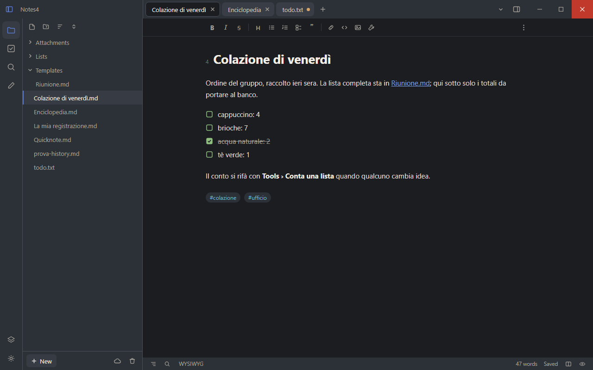
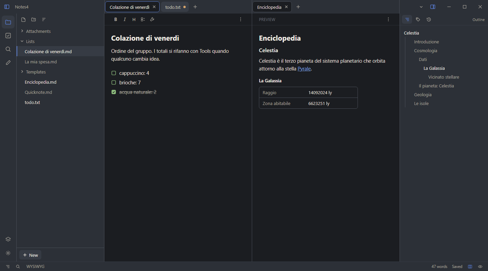
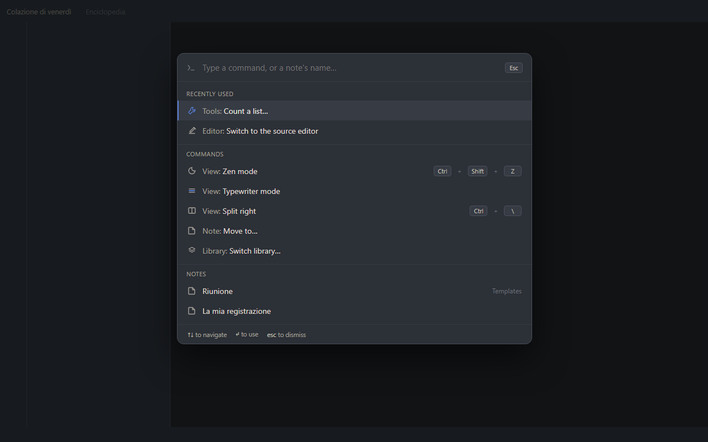
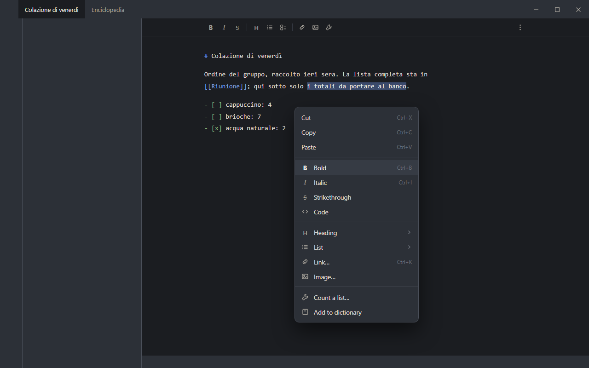
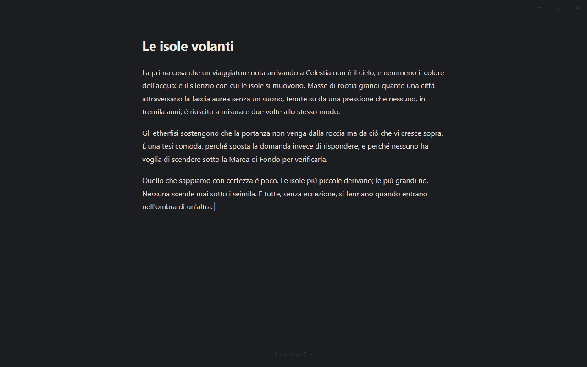
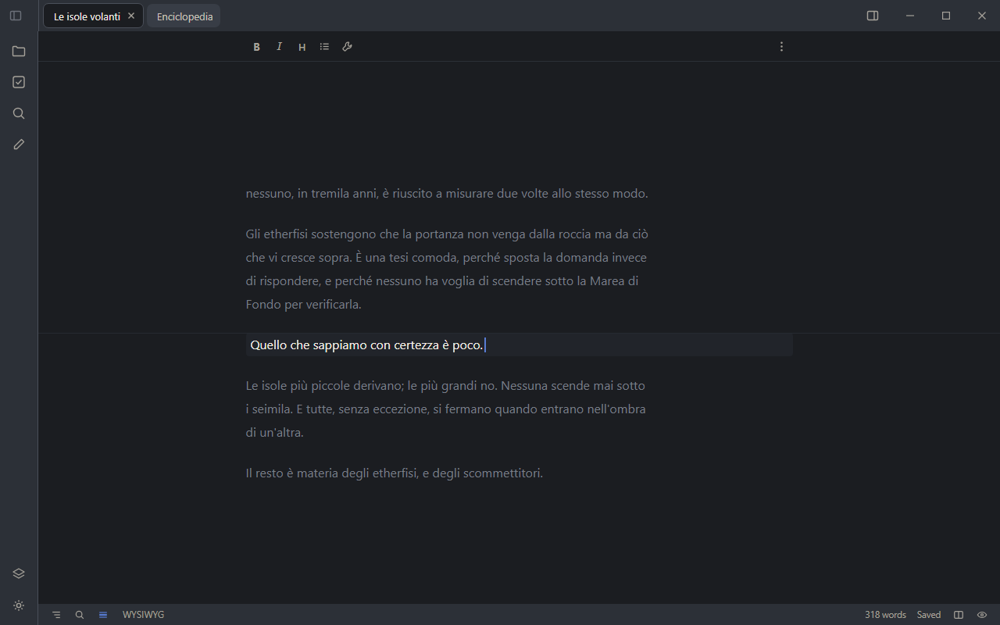
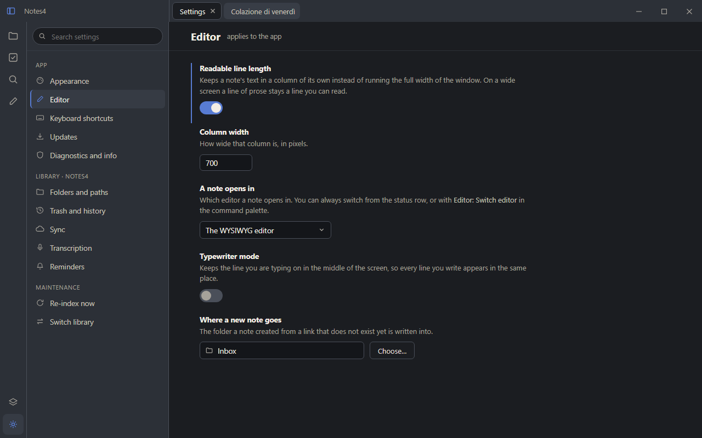
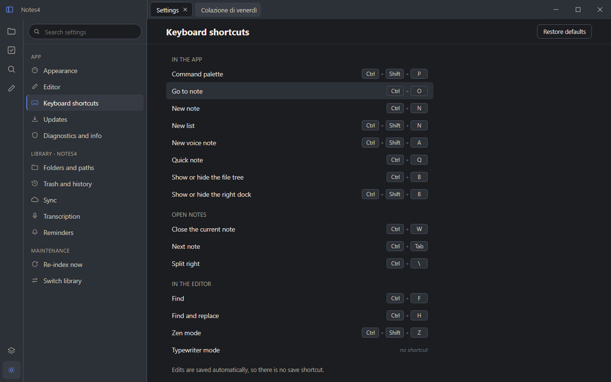
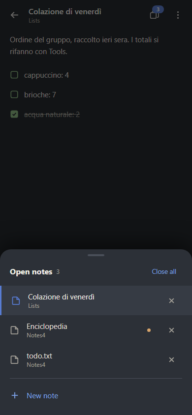

# Desktop mockups — 0.0.8

The shell the 0.0.8 desktop round is built against, drawn after a
reference study of Obsidian and VS Code (issue #152) and agreed before
any of it was written (epic #153).

They are mockups, not screenshots of the app: everything here is HTML
drawn to look like Niman, using the real palette from
`lib/src/ui/theme/niman.dart`. Where a mockup and the app disagree, the
app is what shipped — these record what was decided, and when.

**Inspiration, not imitation.** Obsidian and VS Code answered questions
Niman had not answered yet — where tabs live, how a settings screen is
laid out, how a command palette is reached. The vocabulary stays Niman's
(library, note, folder, tag), and so does the palette.

## The shell

### [Main](Main.png) — tabs, thin rail, centred column



The four decisions in one picture:

- **The rail is 48 px and icons only.** Files, tasks, search, scratch at
  the top; the library switcher and the theme at the foot. No labels —
  the tooltip carries the name.
- **Tabs live in the title bar**, in the space the app's own title bar
  already owns (#151). The left region ends exactly where the file tree
  ends, so the two edges line up.
- **The note is a centred column**, on by default, with a width setting.
  A 1280 px window does not mean a 1280 px line of prose.
- **The toolbar is aligned to that column** and dense, with the note's
  `⋮` menu at the right end of the same row rather than in a header of
  its own.

### [Split](Split.png) — the tabs stay in the title bar



When a pane splits, the title-bar row divides at the same x as the pane
divider, and each region holds its own pane's tabs. **Nothing moves when
you split**, and nothing moves when the file tree is hidden — the tabs
never leave that row.

The right dock is here too: outline, tags and history as tabbed panes,
openable and closable. It is not on the phone.

## Reaching things without adding chrome

### [Palette](Palette.png) — commands and notes in one search



One palette, not two: typing looks through commands *and* notes at the
same time, each row saying which it is and what would run it. This is
what makes a shortcut cleared to nothing a valid state (#155 before
#159).

### [ContextMenu](ContextMenu.png) — formatting on right-click



The same formatting actions the toolbar offers, on right-click in the
editor, so the toolbar is a convenience rather than the only route.

The toolbar is present in **both** modes — source and WYSIWYG — aligned
and dense. It does not disappear in source mode.

## Writing modes — chrome taken away

### [Zen](Zen.png) — everything but the note



Rail, tree, tabs, toolbar and status row all gone; the note keeps its
column. Because the status row is hidden, the palette and the keyboard
are the only ways back out — which is why the palette (#155) comes
first.

### [Typewriter](Typewriter.png) — the line stays in the middle



The current line is locked to the middle of the viewport and the text
scrolls under it.

**Zen and typewriter coexist.** They are two independent states, never
one `writingMode` enum: turning one on must not disturb the other.

## The screens that had to change

### [Settings](Settings.png) — search and sections left, the area right



Two columns: search over the list of sections on the left, the active
section on the right. A row is **label / description / control stacked**
in a capped column, not a label on the left and a control lost at the
far right of a wide window.

### [Shortcuts](Shortcuts.png) — the same shape



The shortcuts screen is a settings section like any other, in the same
two columns. Conflicts are named where they happen, a binding can be
reverted, and a binding cleared to nothing is valid (#159).

## The phone gets the same model, its own shape

### [Android](Android.png) — the open-notes switcher



Tabs are a desktop shape for a model that is not desktop-specific: more
than one note open at once. On a phone that model surfaces as an
**open-notes switcher** — a sheet listing what is open, with the unsaved
dot and a close on each row — reached from a count badge in the app bar.

Same capability, not the same UI. The right dock has no phone
equivalent in this round and says so in `docs/user/platforms.md`.

## Re-rendering these

The sources are in [`html/`](html) — plain, self-contained HTML files
with no build step and no external assets. Edit one and render it with
headless Chrome:

```bash
chrome --headless --disable-gpu --hide-scrollbars \
  --window-size=1280,800 --screenshot=Main.png html/Main.html
```

`Split.html` is 1440×800 and `Android.html` is 390×844; the rest are
1280×800.
