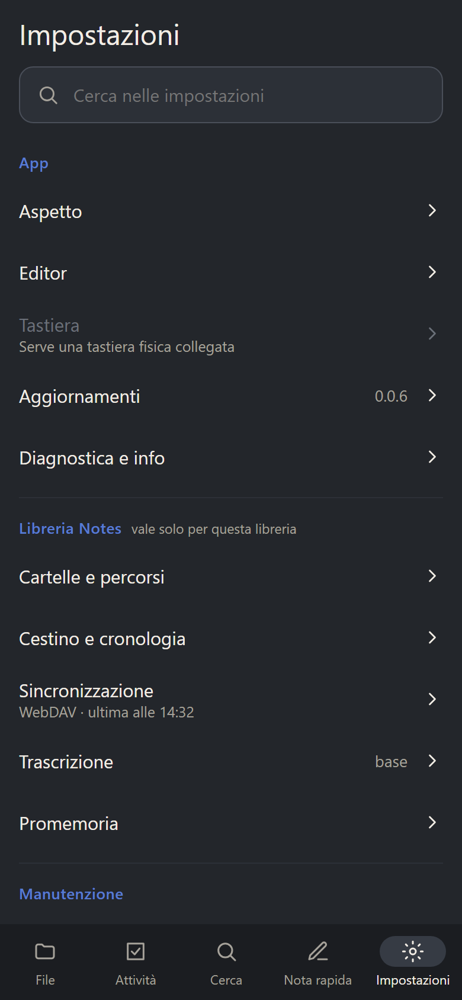
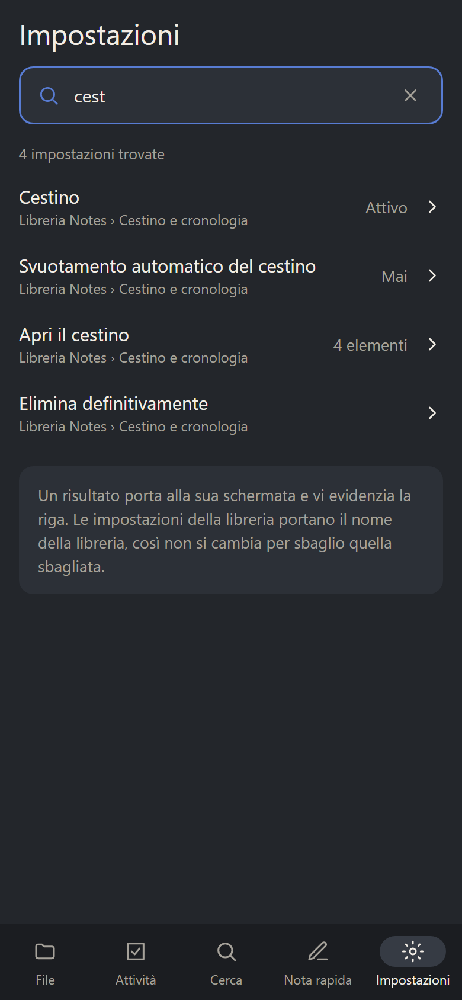
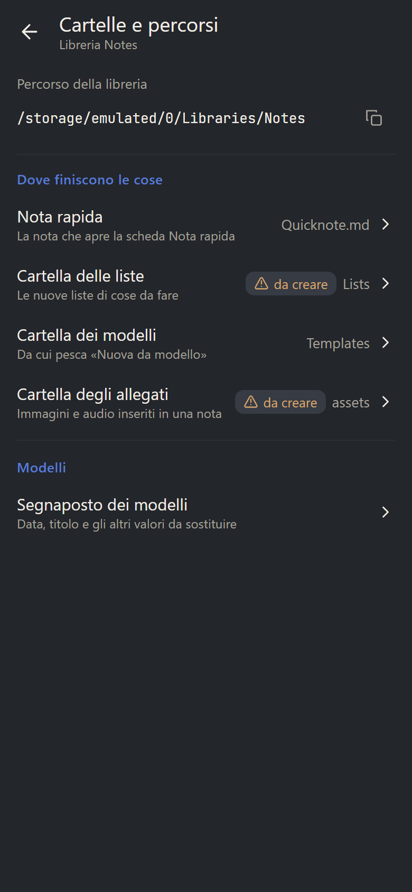
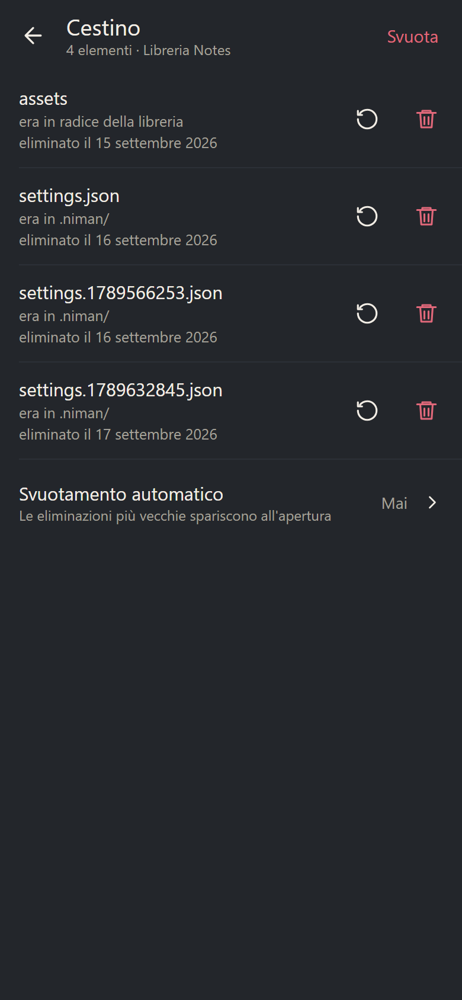
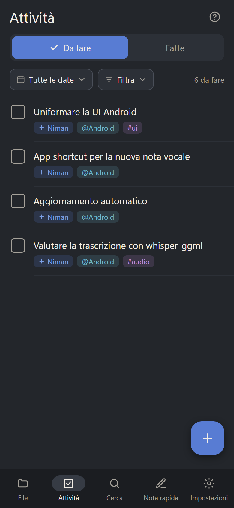

# The Android UI pass: what is left

A review of the Android screens on 2026-09-17 turned up a set of
inconsistencies — the same question asked two ways, controls that move
under the thumb, labels left in English, icons of two weights in one
list. Part of it has landed. This folder holds the mockups for the rest,
so the work can be picked up without re-deriving it.

The pictures are phone-sized (390×844) and wear the app's own Night
palette, so they can be compared with a device screenshot directly.

## What has landed

| | |
|---|---|
| #73 | A note opens as a page, not a tab: the tab bar is gone from the note page, back lands on the tab it was opened from (the quick note included), the app bar carries the folder under the title, the formatting toolbar follows the keyboard and stays out of preview, and the freed height funds the status row's 48 dp targets |
| #122 | The preview toggle keeps its place when the fullscreen button appears |
| #124 | The find button keeps its slot in preview-only mode; one icon weight per list |
| #125 | One dialog for "which folder?" — `MovePicker` gone, the move can create a folder |
| #126 | The row menu says what it acts on, and groups what it offers |
| #127 | The FAB menu names its actions |
| #129 | The labels that were still English: the status row, the trash, the menu's "here" |

Two rules came out of it and are written down in
[`conventions.md`](../dev/conventions.md):

- Icons are outline; a filled icon says a state is on.
- A control that shows in only some states keeps its place — disable it,
  or put it on the side the row grows from, so nothing already on screen
  moves under a thumb that is already on it.

## 1. Settings: a home, sub-screens and a search field

Issue #104. Landed, except the last dot.

Ten sections in one column, and finding *Versions to keep* is blind
scrolling.

- A home of areas, each opening its own screen, with a search field on
  top. A result carries the area it came from, so nothing is changed by
  accident in the wrong place. Tapping one opens the area's screen and
  flashes the row.
- App-wide settings separated from the library's own, with the library
  named — the current screen mixes them with nothing to tell them apart.
- *Reindex*, *Switch library* and *Close library* are actions, not
  settings: they move to a **Maintenance** group.
- A row that is disabled says why (the keyboard shortcuts need a physical
  keyboard).
- A value the library does not actually hold says so: `assets · to
  create` rather than a confident `assets`. The picker behind it already
  refuses to select a folder that is not there (#94); the row still
  claims it exists.
- Switch subtitles are uneven — *Preview* and *Line numbers* carry one,
  *Markdown source* and *WYSIWYG* do not, and those two are precisely the
  pair whose combination is not obvious.
- Still open: the folder rows' description lines (*Le nuove liste…*),
  and the installed version riding on the *Updates* row.

## 2. The trash rejoins the family

Landed.

It was the only list in the app built out of `Card`s, while File,
Settings and the toolbar screen are flat rows.

- Flat rows, with the count and the library under the title, and the
  parent folder written out (`was in the library root` for a
  top-level note).
- **Empty** moved to the app bar as a text action, disabled — not
  gone — when there is nothing to empty. The corner it owned is where
  every other screen puts *create*.
- The auto-empty setting rides at the bottom of the screen it
  governs, showing its value and opening it highlighted.

## 3. Tasks: a project is not a context

Landed.

`+Niman` and `@Android` were drawn in the same purple, so the two things
`todo.txt` deliberately separates looked alike at a glance.

- Token chips are colored by kind, not by name: projects wear the
  accent, contexts the syntax tag teal, tags the tertiary — the
  per-name hash colors are gone, with them `tag_color.dart`.
- The filter row holds two pills of one shape — leading icon, label,
  trailing chevron — that shrink with an ellipsized label instead of
  clipping a 360 dp row in long languages. The count keeps their text
  style on their line.

## 4. Smaller things, without a picture

Landed, all three.

- **No undo after a delete.** The notice now offers *Undo* while the
  trash toggle is on, restoring the freshest deletion of that path.
  A hard delete still has nothing to offer.
- **The WebDAV screen.** *Test* and *Save* ride side by side in the
  form instead of a full-width bottom bar. *Test* stays enabled and
  complains at the address field; *Save* unlocks for the tested
  address, next to the result card that says why.
- **Where a new item lands.** Four actions use the FAB target folder
  they open over; *New list note* names its folder on the button
  (`New list note · Lists`), read from the setting at menu-open
  time.

## Regenerating the pictures

They were rendered from the mockup canvas at 390×844 with headless
Chrome. Nothing in the app builds them, and nothing reads them: they are
here to be looked at, and this page is the record of what they mean.
