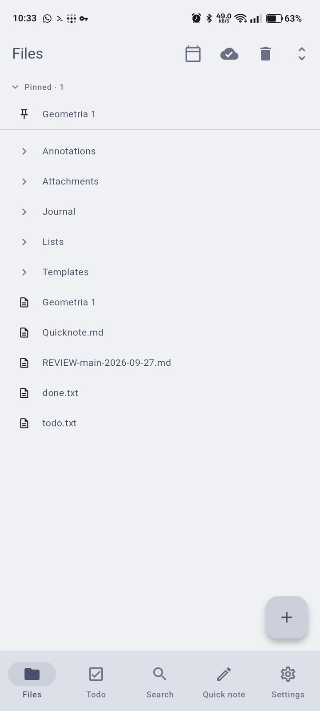
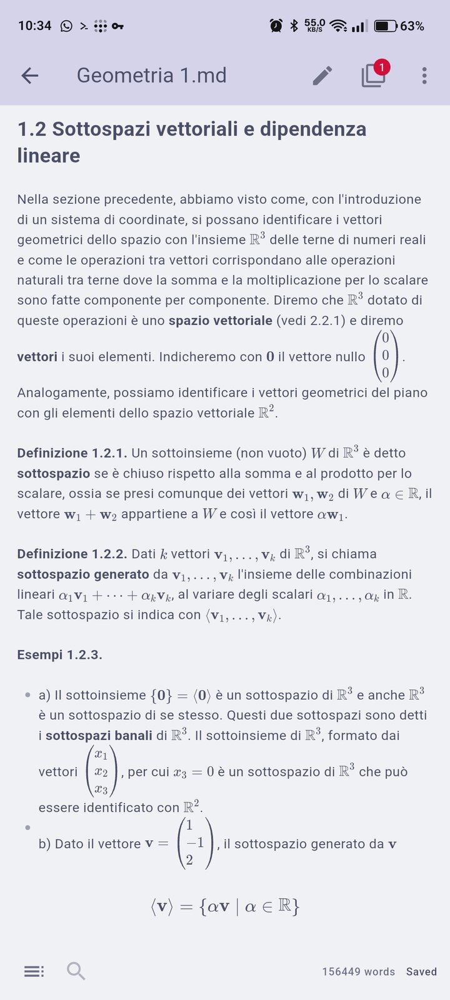
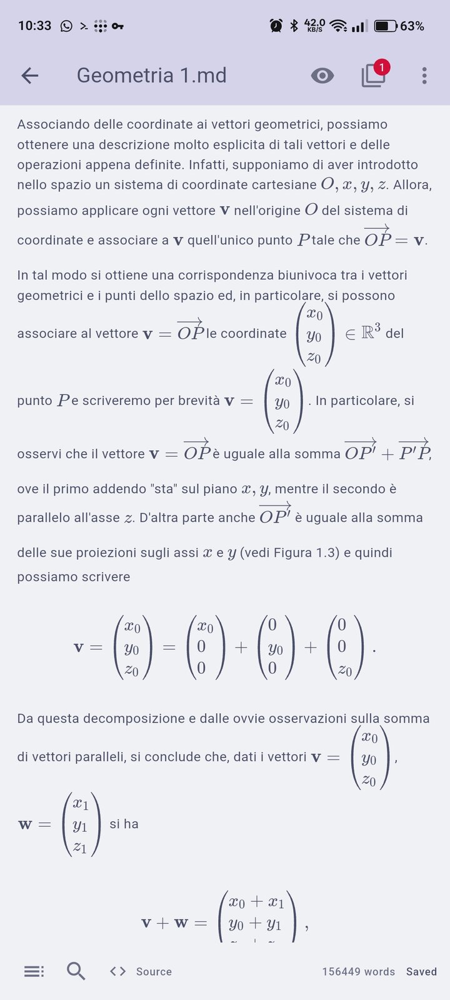
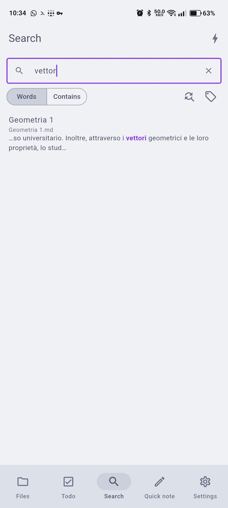
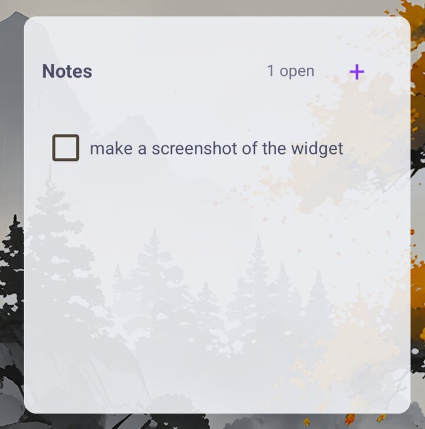
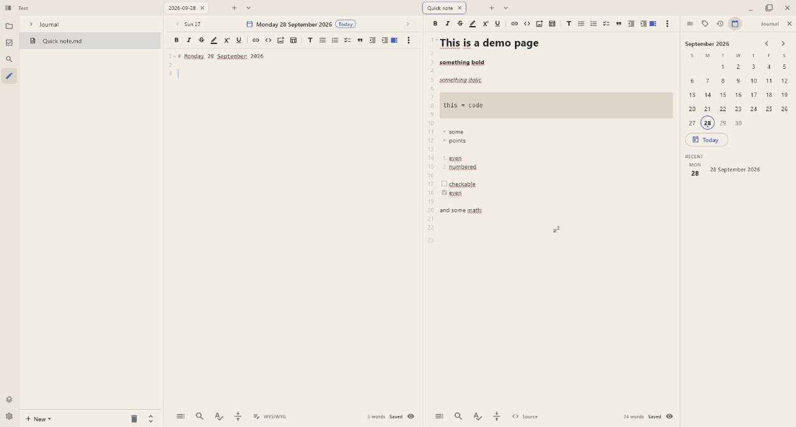
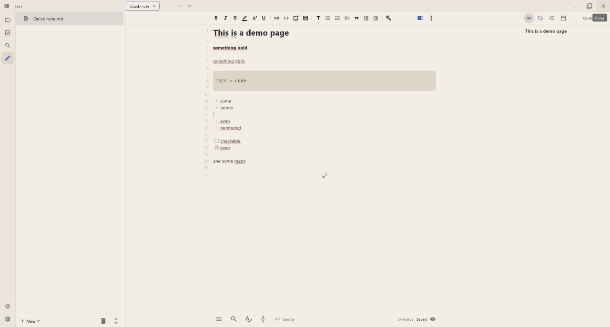
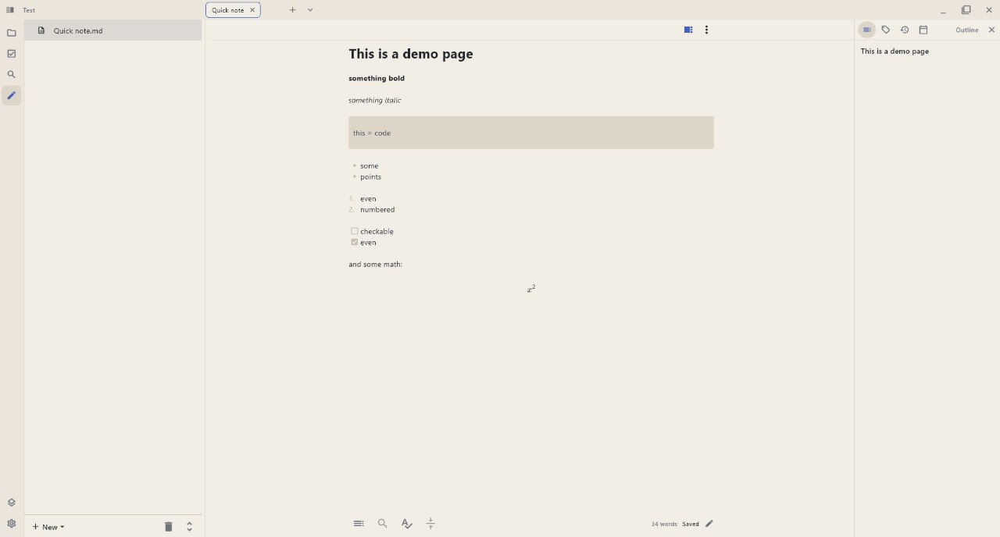
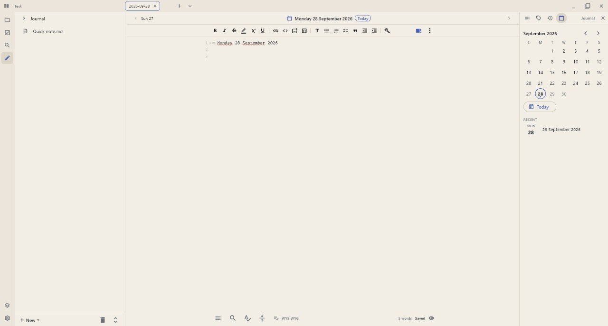
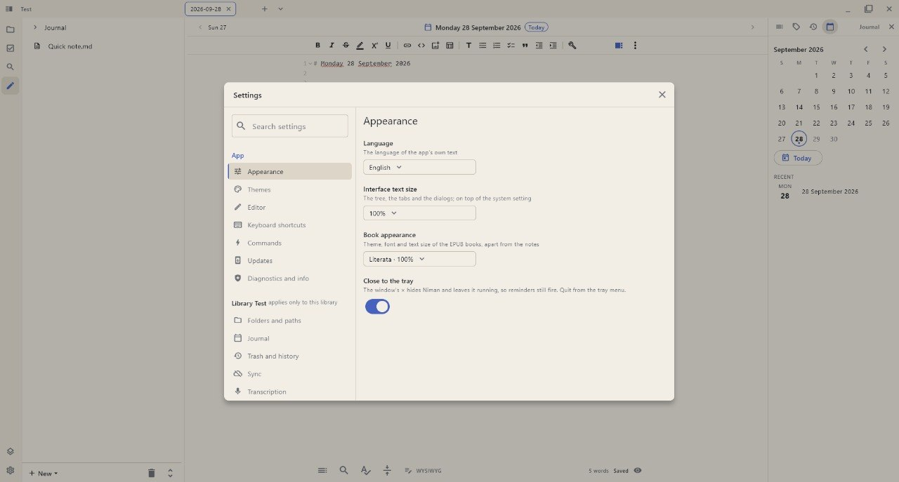

**Niman Is More (than) A Notebook.**

A multiplatform Markdown note-taking app where your notes are just files. One
note = one `.md` file on disk, organized in folders however you like. The app's
database is only a rebuildable index — your files are always the source of
truth. No lock-in, no proprietary format.

> **Status:** the project is under active development; what is planned and what
> is in progress is tracked in the
> [issue tracker](https://github.com/Nihmar/Niman/issues).

## Screenshots

From the app itself, in English, on a library of sample notes — a phone
(Android) on the left, the Linux desktop on the right.

  
  
  
  
  
  

  
  
  
  

## The user guide

Start with [getting started](docs/user/getting-started.md), or pick the guide
you need:

- [Editing](docs/user/editing.md) — Markdown, math, images, spellcheck, the
  read view.
- [List notes and shopping lists](docs/user/lists.md) — checklists with
  quantities.
- [Organization](docs/user/organization.md) — trash, history, frontmatter and
  tags.
- [Export](docs/user/export.md) — a note, a folder or the library out as
  Markdown, HTML, PDF or EPUB.
- [Journal](docs/user/journal.md) — one note per day, with a calendar.
- [Search](docs/user/search.md) — full-text search, field and tag search.
- [Links](docs/user/links.md) — wikilinks and Markdown links, between notes
  and into a PDF or a book.
- [Templates](docs/user/templates.md) — placeholders, filters and prompts.
- [Tasks and reminders](docs/user/tasks.md) — `todo.txt`, and alarms that
  fire.
- [Themes](docs/user/themes.md) — the shipped palettes, and one of your own.
- [Settings reference](docs/user/settings.md) — every key, per library.
- [Shortcuts](docs/user/shortcuts.md) — the keyboard, and what is remappable.
- [Sync](docs/user/sync.md) — WebDAV to your own server.
- [Home-screen widgets](docs/user/widgets.md) — the todo list and a pinned
  note (Android).
- [Platform notes](docs/user/platforms.md) — Android, Linux, Windows.

## Building and changing Niman

- [Architecture](docs/dev/architecture.md) — the modules, and what each holds.
- [Building](docs/dev/building.md) — flavors, platforms, the local scripts.
- [Code conventions](docs/dev/conventions.md) — the rules a change is held to.
- [Release process](docs/dev/releasing.md) — tags, artifacts, signing.

The [design records](docs/records/README.md) are the research and measurement
behind the features, kept as they were written rather than kept current.
