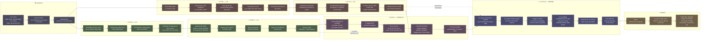

```mermaid
flowchart LR
    %% ============================================
    %% FLUSSO CAUSALE — "La Duchessa e il Contrabbandiere"
    %% Revisione 2026-10-19: medaglia e terzo incontro
    %% prima del colpo di stato
    %% ============================================

    subgraph PASSATO["⏳ PASSATO"]
        direction TB
        A1["Lei: 6 anni<br/>figlia unica, sotto la madre<br/>Lui: 5 anni<br/>orfano, genia del porto"]
        A2["Primo incontro<br/>Lei si intrufola su una barca<br/>Lui la salva"]
        A3["Separazione<br/>Crescono in mondi diversi"]
        A1 --> A2 --> A3
    end

    subgraph ATTO1_L["📖 ATTO I — LEI"]
        direction TB
        B1["Morte della madre<br/>Lei diventa erede"]
        B2["Aristocrazia e alta borghesia<br/>le si rivoltano contro"]
        B3["Crisi del ducato<br/>raccolti ridotti, popolo impoverito"]
        B4["Lei produce merce<br/>e la vende sotto falso nome"]
        B5["Recupera benevolenza<br/>del popolo"]
        B1 --> B2 --> B3 --> B4 --> B5
    end

    subgraph ATTO1_M["⚔️ ATTO I — LUI"]
        direction TB
        C1["Un bambino viene ucciso<br/>da un membro della gang"]
        C2["Rottura del codice etico<br/>rifiuto della banda"]
        C3["Arruolamento nella guardia<br/>trova un mentore"]
        C4["Respinge la mala senza usare i poteri<br/>ma la mala non è sconfitta"]
        C1 --> C2 --> C3 --> C4
    end

    subgraph ATTO2_L["📖 ATTO II — LEI"]
        direction TB
        E1["Celebrazione dell'isola<br/>i debuttanti incontrano le casate"]
        E2["Una debuttante approva<br/>le propone un contratto commerciale"]
        E3["Un falso amico si offre<br/>lei dice NO<br/>sceglie l'alleata giusta"]
        E4["L'alleata diventa sorella<br/>spia nell'alta borghesia"]
        E1 --> E2 --> E3 --> E4
    end

    subgraph ATTO2_M["⚔️ ATTO II — LUI"]
        direction TB
        D1["Episodio del nobile<br/>abusa e uccide prostitute<br/>lui lo pesta e lo denuncia"]
        D2["Capisce che il marcio<br/>è anche in alto"]
        D3["Attacco dei pirati<br/>all'isola principale"]
        D4["Salva un commilitone<br/>diventa eroe"]
        D5["Trova le carte<br/>mandante = alta borghesia"]
        D1 --> D2 --> D3 --> D4 --> D5
    end

    subgraph INCROCIO["🔀 ATTO II — INCROCIO"]
        direction TB
        H1["Lei gli conferisce la medaglia<br/>secondo incontro<br/>non sanno chi sono"]
        H2["Il maggiordomo<br/>riconosce il ragazzo"]
        H3["Terzo incontro<br/>lei sa chi è lui, lui no<br/>carte e prove passano a lei"]
        H4["COLPO DI STATO<br/>popolo sobillato<br/>palazzo assediato<br/>maggiordomo ferito/esiliato"]
        H5["Lei tocca il fondo<br/>perde popolo, sicurezza, titolo"]
        H1 --> H2 --> H3 --> H4 --> H5
    end

    subgraph ATTO3["📖⚔️ ATTO III — INSIEME"]
        direction TB
        F1["Lei usa le carte di lui e l'alleata<br/>per incriminare la casata ostile"]
        F2["La casata chiede il duello<br/>Lei vince con forza E astuzia"]
        F3["Viaggio al Soglio<br/>lei riceve una medaglia<br/>lui entra nella sua guardia"]
        F4["Lui sconfigge completamente la mala<br/>sana il suo nome<br/>CHIUSURA DEL SUO ARCO"]
        F5["Separazione di un anno<br/>lettere quasi giornaliere"]
        F6["Fine dell'anno<br/>lui ha la posizione<br/>lei ha il piano"]
        F1 --> F2 --> F3 --> F4 --> F5 --> F6
    end

    subgraph FINALE["💛 FINALE"]
        direction TB
        G1["Bacio<br/>chiude l'arco romantico"]
        G2["Lei usa lui come arma<br/>contro lo zoccolo duro di corruzione"]
        G3["PACE DEL DUCATO<br/>popolo riconciliato<br/>corruzione sconfitta<br/>lei sovrana, lui guerriero-pari"]
        G1 --> G2 --> G3
    end

    %% Collegamenti tra i blocchi
    A3 --> B1
    A3 --> C1
    B5 --> E1
    C4 --> D1
    D5 --> H1
    E4 --> H4
    D5 -.->|"le carte<br/>passano a lei"| H3
    E4 -.->|"informazioni<br/>dell'alleata"| F1
    H5 --> F1
    F6 --> G1

    %% Stile
    classDef passato fill:#4a4a5e,stroke:#888,color:#fff
    classDef attoL fill:#5e4a4a,stroke:#c88,color:#fff
    classDef attoM fill:#4a5e4a,stroke:#8c8,color:#fff
    classDef incrocio fill:#5e4a5e,stroke:#c8c,color:#fff
    classDef atto3 fill:#4a4a6e,stroke:#88c,color:#fff
    classDef finale fill:#6e5e4a,stroke:#cc8,color:#fff

    class A1,A2,A3 passato
    class B1,B2,B3,B4,B5,E1,E2,E3,E4 attoL
    class C1,C2,C3,C4,D1,D2,D3,D4,D5 attoM
    class H1,H2,H3,H4,H5 incrocio
    class F1,F2,F3,F4,F5,F6 atto3
    class G1,G2,G3 finale
```
